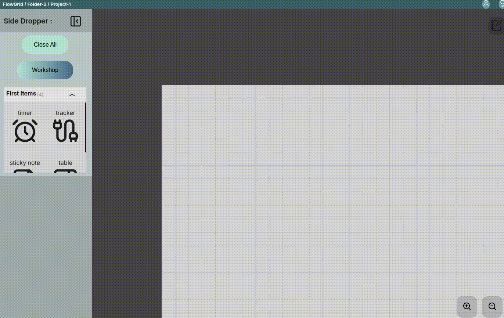
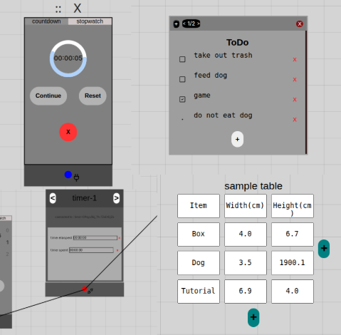
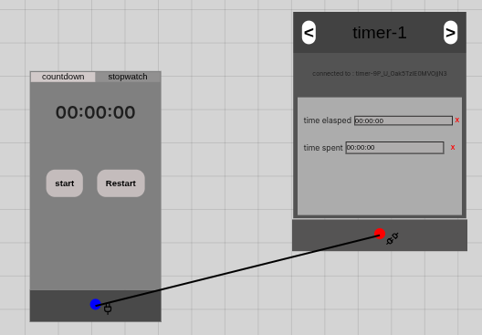
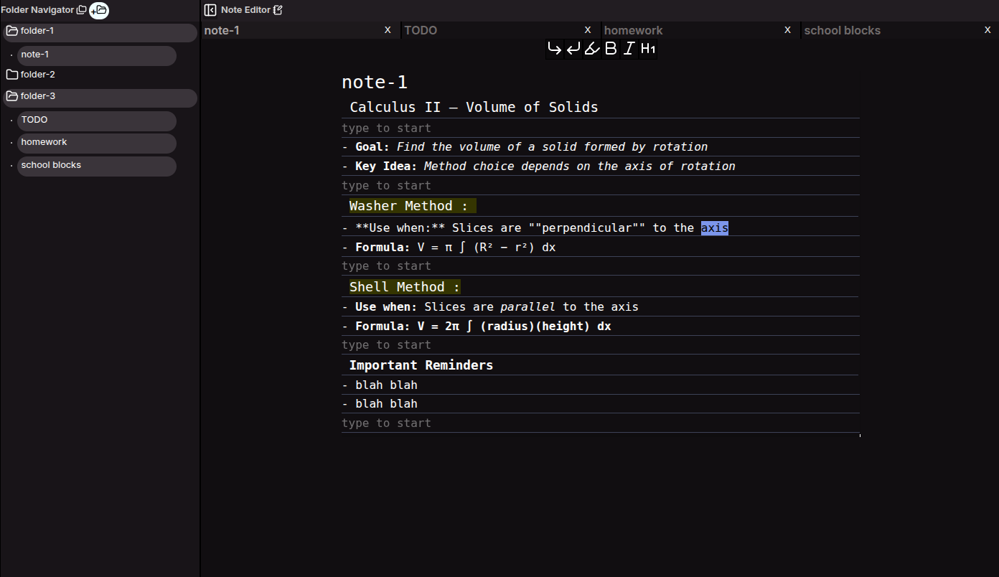

Finished Project!
# FlowGrid
An Obsidian-inspired markdown note app with a drag-and-drop editor for note-taking, organization, and daily routine tracking.

<h1>Features</h1>

<ul>
  <li>
    <strong>Drag and Drop Editor</strong><br />
    
  </li>

  <li>
    <strong>Premade Components to make your work easier</strong><br />
    
  </li>

  <li>
    <strong>Trackable components</strong><br/>
      
  </li>
  <li>
    <strong>Note Taking Interface</strong><br />
      
  </li>
  <li>
    <strong>Markdown Note Format</strong> <br />
      
  </li>
</ul>

# Tech Stack
- **Frontend:** React, Zustand, React-Query, Sass(css), Vitest, React-Testing-Library
- **Backend:** Django w/ REST Framework  
- **Database:** PostgreSQL

## Installation
```bash
git clone https://github.com/jabrews/FlowGrid.git
cd frontend
npm install
npm run dev
```
```bash
cd ../backend
python3 -m venv venv
source venv/bin/activate # 'on Mac/Linux'
# or use: venv\Scripts\activate # 'on Windows'
pip install -r requirements.txt
python3 manage.py makemigrations
python3 manage.py runserver
```


